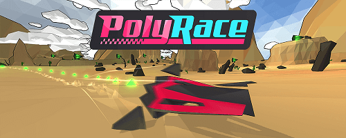

# Overview

PolyRace is a fast-paced futuristic racing game with a procedural level generator. Choose between 4 different hovercrafts with each of them having its own physic properties and a unique sci-fi hull. Run on generated terrains shaped with valleys, hills and mountains, mixing long straight lines and narrow curves while paying attention to your shield.

# Getting Started

This project contains all the sources code and assets of the game without the online part: race of the day, missions and challenge has been removed.

* Make sure you have Blender 3.0 installed for importing 3D assets.
* Import the project in Unity3D 2020.3.25f1. 
* Open the scene Scenes/Main_Scene and press the play button.

